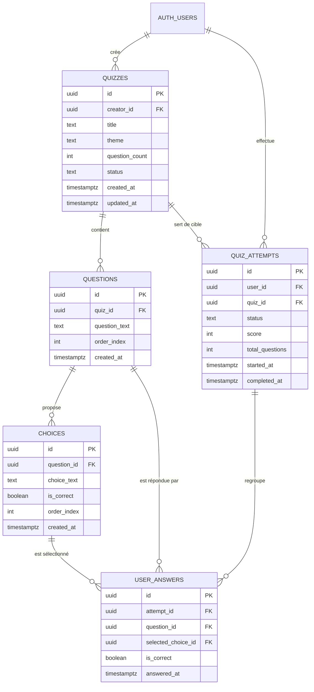
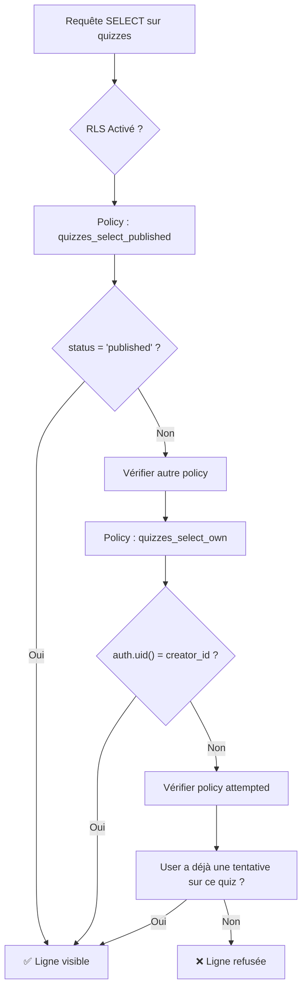
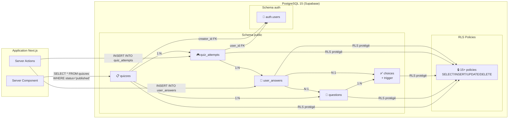

# Rapport Backend — Base de données et persistance

## Introduction

Le backend de Quizia repose intégralement sur **PostgreSQL 15**, hébergé via la solution **Supabase Cloud (SaaS)**. Ce choix garantit une persistance relationnelle robuste, des garanties d'intégrité référentielle et un système d'authentification natif (`auth.users`). Ce rapport décrit en détail le **schéma de base de données**, les **contraintes d'intégrité**, les **index de performance**, les **triggers**, les **politiques de sécurité au niveau des lignes (RLS)** et l'historique des **migrations**.

---

## Vue d'ensemble du schéma

Le schéma est organisé autour de **5 tables principales** dans le schéma `public`, complétées par le système d'authentification natif de Supabase (`auth.users`). Les données sont structurées selon un modèle de type **Quiz-Question-Choix-Réponse** (Q-Q-C-R), couplé à un suivi des tentatives de jeu individuelles.

### Diagramme Entité-Association (ER)



> **Description du schéma** — Ce diagramme Entité-Relation montre la **structure relationnelle complète** de la base de données. Il représente les 6 entités principales (`AUTH_USERS` du système Supabase, plus nos 5 tables métier) et leurs cardinalités. On y voit que : un utilisateur peut créer plusieurs quiz (`||--o{`), un quiz contient plusieurs questions, une question propose plusieurs choix, une tentative regroupe plusieurs réponses, etc. Les clés primaires (PK) et étrangères (FK) sont indiquées pour chaque table, permettant de comprendre en un coup d'œil comment les données sont liées.

---

## 1. Table `quizzes` — Le cœur métier

Cette table stocke l'intégralité des quiz créés par les utilisateurs.

### Colonnes et types

| Colonne | Type | Contraintes | Description |
|---------|------|-------------|-------------|
| `id` | `uuid` | `PRIMARY KEY`, `DEFAULT gen_random_uuid()` | Identifiant unique du quiz |
| `creator_id` | `uuid` | `NOT NULL`, `REFERENCES auth.users(id)` | Créateur du quiz (clé étrangère vers le système d'authentification) |
| `title` | `text` | `NOT NULL` | Titre affiché du quiz |
| `theme` | `text` | `NOT NULL` | Thème / catégorie (ex. : "Histoire", "Sciences") |
| `question_count` | `integer` | `NOT NULL`, `CHECK (question_count BETWEEN 5 AND 30)` | Nombre de questions attendu, entre 5 et 30 |
| `status` | `text` | `NOT NULL`, `DEFAULT 'draft'`, `CHECK (status IN ('draft', 'published', 'archived'))` | Cycle de vie du quiz |
| `created_at` | `timestamptz` | `NOT NULL`, `DEFAULT now()` | Date de création |
| `updated_at` | `timestamptz` | `NOT NULL`, `DEFAULT now()` | Date de dernière modification |

### Contraintes métier

La table impose un **modèle de cycle de vie strict** via le `CHECK` sur `status`. Un quiz ne peut jamais sortir de ces trois états. Le `CHECK` sur `question_count` garantit que l'application respecte ses propres règles métier (minimum 5 questions pour une expérience significative, maximum 30 pour éviter la fatigue utilisateur).

Le lien avec `auth.users` (table interne de Supabase) permet de récupérer l'email ou d'autres métadonnées du créateur sans dupliquer les informations d'identité.

### Index dédiés

| Nom | Colonnes | Type | Objectif |
|-----|----------|------|----------|
| `idx_quizzes_creator_id` | `creator_id` | B-tree | Accélère la récupération de tous les quiz d'un utilisateur (`/my-quizzes`, `/dashboard`) |
| `idx_quizzes_status` | `status` | B-tree (partiel) | **Index partiel** `WHERE status = 'published'`. Accélère la requête principale du catalogue (`/quizzes`) en excluant les brouillons et archivés de l'index. |

---

## 2. Table `questions` — Contenu pédagogique

Stocke chaque question individuelle d'un quiz.

### Colonnes et types

| Colonne | Type | Contraintes | Description |
|---------|------|-------------|-------------|
| `id` | `uuid` | `PRIMARY KEY`, `DEFAULT gen_random_uuid()` | Identifiant de la question |
| `quiz_id` | `uuid` | `NOT NULL`, `REFERENCES quizzes(id) ON DELETE CASCADE` | Quiz parent |
| `question_text` | `text` | `NOT NULL` | Corps de la question |
| `order_index` | `integer` | `NOT NULL`, `DEFAULT 0` | Ordre d'affichage dans le quiz |
| `created_at` | `timestamptz` | `NOT NULL`, `DEFAULT now()` | Date de création |

### Contraintes métier

La clé étrangère `quiz_id` porte la clause **`ON DELETE CASCADE`**. Si un quiz est supprimé, toutes ses questions le sont automatiquement. Cela évite les lignes orphelines dans la base et simplifie la logique applicative.

La colonne `order_index` est essentielle car PostgreSQL n'offre pas d'ordre implicite. L'éditeur et le jeu reposent sur un tri explicite par cet index pour présenter les questions dans l'ordre défini par le créateur (ou l'IA).

### Index dédiés

| Nom | Colonnes | Type | Objectif |
|-----|----------|------|----------|
| `idx_questions_quiz_id` | `quiz_id` | B-tree | Jointure rapide entre quiz et questions lors du chargement d'un jeu ou de l'éditionur |

---

## 3. Table `choices` — Les propositions de réponse

Chaque question possesse plusieurs choix (généralement 4), dont un seul est correct.

### Colonnes et types

| Colonne | Type | Contraintes | Description |
|---------|------|-------------|-------------|
| `id` | `uuid` | `PRIMARY KEY`, `DEFAULT gen_random_uuid()` | Identifiant du choix |
| `question_id` | `uuid` | `NOT NULL`, `REFERENCES questions(id) ON DELETE CASCADE` | Question parente |
| `choice_text` | `text` | `NOT NULL` | Texte affiché du choix |
| `is_correct` | `boolean` | `NOT NULL`, `DEFAULT false` | Indique si c'est la bonne réponse |
| `order_index` | `integer` | `NOT NULL`, `DEFAULT 0` | Position parmi les choix |
| `created_at` | `timestamptz` | `NOT NULL`, `DEFAULT now()` | Date de création |

### Contraintes métier

La clause `ON DELETE CASCADE` sur `question_id` garantit que la suppression d'une question efface aussi tous ses choix. C'est essentiel lors de la suppression d'une question dans l'éditeur.

### Trigger de garde : `check_single_correct_choice()`

Un trigger `BEFORE INSERT OR UPDATE` est attaché à cette table. Son rôle est d'empêcher l'insertion d'une deuxième ligne avec `is_correct = true` pour la même `question_id`.

```sql
-- Logique du trigger :
-- Si NEW.is_correct = true :
--   SELECT COUNT(*) FROM choices WHERE question_id = NEW.question_id AND is_correct = true;
--   Si COUNT > 0 : RAISE EXCEPTION 'Une seule réponse correcte autorisée par question';
```

*Bien que l'application implémente cette vérification dans son code métier, le trigger offre une garantie supplémentaire au niveau base de données contre les bugs ou insertions manuelles.*

### Index dédiés

| Nom | Colonnes | Type | Objectif |
|-----|----------|------|----------|
| `idx_choices_question_id` | `question_id` | B-tree | Chargement rapide des choix lors de l'affichage d'une question |

---

## 4. Table `quiz_attempts` — Sessions de jeu

Chaque fois qu'un utilisateur (ou un visiteur anonyme) lance un quiz, une ligne est créée dans cette table pour suivre la progression.

### Colonnes et types

| Colonne | Type | Contraintes | Description |
|---------|------|-------------|-------------|
| `id` | `uuid` | `PRIMARY KEY`, `DEFAULT gen_random_uuid()` | Identifiant de la session |
| `user_id` | `uuid` | `NULLABLE`, `REFERENCES auth.users(id) ON DELETE SET NULL` | Joueur (NULL si anonyme) |
| `quiz_id` | `uuid` | `NOT NULL`, `REFERENCES quizzes(id) ON DELETE CASCADE` | Quiz joué |
| `status` | `text` | `NOT NULL`, `DEFAULT 'in_progress'`, `CHECK (status IN ('in_progress', 'completed'))` | État de la session |
| `score` | `integer` | `NULLABLE` | Nombre de bonnes réponses à la fin |
| `total_questions` | `integer` | `NOT NULL` | Nombre total de questions du quiz au début |
| `started_at` | `timestamptz` | `NOT NULL`, `DEFAULT now()` | Date de début |
| `completed_at` | `timestamptz` | `NULLABLE` | Date de fin (NULL si abandonné) |

### Contraintes métier

**Session anonyme** : `user_id` est volontairement nullable. C'est le mécanisme clé qui permet de jouer sans compte. Lorsqu'un visiteur anonyme lance un quiz, `user_id` vaut `NULL` mais la ligne est tout de même insérée. L'application utilise l'ID de session stocké dans un cookie local (`anon_attempt_id`) pour récupérer la bonne ligne `quiz_attempts`.

**Cascade de suppression** : `ON DELETE CASCADE` sur `quiz_id` garantit que si un quiz est supprimé par son créateur, toutes les sessions de jeu associées disparaissent également. Cela est nécessaire pour respecter la confidentialité (RGPD) : un utilisateur qui supprime son contenu ne souhaite pas que des traces de tentatives persistents en base.

### Index dédiés

| Nom | Colonnes | Type | Objectif |
|-----|----------|------|----------|
| `idx_attempts_user_id` | `user_id` | B-tree | Récupération de l'historique d'un joueur (`/dashboard`) |
| `idx_attempts_quiz_id` | `quiz_id` | B-tree | Analytics : nombre de fois qu'un quiz a été joué |

---

## 5. Table `user_answers` — Réponses individuelles

Stocke chaque réponse donnée par l'utilisateur pendant une session de jeu. C'est la table la plus fine granularité.

### Colonnes et types

| Colonne | Type | Contraintes | Description |
|---------|------|-------------|-------------|
| `id` | `uuid` | `PRIMARY KEY`, `DEFAULT gen_random_uuid()` | Identifiant de la réponse |
| `attempt_id` | `uuid` | `NOT NULL`, `REFERENCES quiz_attempts(id) ON DELETE CASCADE` | Session de jeu parente |
| `question_id` | `uuid` | `NOT NULL`, `REFERENCES questions(id)` | Question posée |
| `selected_choice_id` | `uuid` | `NOT NULL`, `REFERENCES choices(id) ON DELETE CASCADE` | Choix sélectionné par l'utilisateur |
| `is_correct` | `boolean` | `NOT NULL` | Justesse de la réponse (dnormalisée pour performance) |
| `answered_at` | `timestamptz` | `NOT NULL`, `DEFAULT now()` | Horodatage |
| `UNIQUE` | `(attempt_id, question_id)` | | Empêche de répondre deux fois à la même question dans la même session |

### Contraintes métier

**Dénormalisation du champ `is_correct`** : La colonne `is_correct` pourrait être calculée dynamiquement via une jointure sur `choices.is_correct`, mais elle est stockée explicitement. Cela élimine une jointure supplémentaire lors de l'affichage des résultats et garantit l'intégrité historique : même si le créateur modifie la bonne réponse (`choices.is correct`) après coup, la base conserve le fait que l'utilisateur avait *à ce moment-là* répondu correctement ou non.

**Contrainte UNIQUE** : La paire `(attempt_id, question_id)` est unique. Cela reflète le fonctionnement du jeu : une seule réponse autorisée par question et par session.

### Index dédiés

| Nom | Colonnes | Type | Objectif |
|-----|----------|------|----------|
| `idx_user_answers_attempt_id` | `attempt_id` | B-tree | Chargement de toutes les réponses d'une session pour calculer le score |
| `uq_user_answers_attempt_question` | `(attempt_id, question_id)` | Unique | Contrainte métier + index de recherche rapide |

---

## 6. Triggers et fonctions automatiques

### Trigger `set_updated_at()` sur `quizzes`

Un trigger `BEFORE UPDATE` sur la table `quizzes` appelle cette fonction pour réinitialiser automatiquement `updated_at` à `now()` à chaque modification. Cela garantit que la colonne est toujours à jour sans intervention du développeur dans le code applicatif.

```sql
CREATE OR REPLACE FUNCTION set_updated_at()
RETURNS TRIGGER AS $$
BEGIN
    NEW.updated_at = now();
    RETURN NEW;
END;
$$ LANGUAGE plpgsql;

CREATE TRIGGER quizzes_updated_at
    BEFORE UPDATE ON quizzes
    FOR EACH ROW
    EXECUTE FUNCTION set_updated_at();
```

---

## 7. Sécurité : Row Level Security (RLS)

Le **Row Level Security** est activé sur toutes les tables principales. C'est le mécanisme de défense principal contre les accès non autorisés. PostgreSQL évalue les policies à chaque requête `SELECT`, `INSERT`, `UPDATE`, `DELETE`.

### Table `quizzes` — Politiques



> **Description du schéma** — Ce diagramme montre l'arbre de décision que PostgreSQL suit pour chaque requête `SELECT` sur la table `quizzes` grâce au Row Level Security (RLS). Quand une requête arrive, PostgreSQL évalue les policies dans l'ordre : d'abord vérifie si le quiz est `published` (public pour tout le monde), sinon vérifie si l'utilisateur est le `creator_id` (propriétaire du quiz), sinon vérifie si l'utilisateur a déjà une tentative sur ce quiz (historique). Si aucune condition n'est remplie, la ligne est refusée (`❌`). C'est le mécanisme central de sécurité qui garantit qu'un utilisateur ne voit que les quiz auxquels il a droit.

| Nom de la policy | Opération | Règle | Explication |
|------------------|-----------|-------|-------------|
| `quizzes_select_published` | `SELECT` | `status = 'published'` | **Public** : tout le monde voit les quiz publiés. |
| `quizzes_select_own` | `SELECT` | `auth.uid() = creator_id` | **Privé** : un créateur voit toujours ses propres quiz, quelle que soit leur statut. |
| `quizzes_select_attempted` | `SELECT` | Existence d'une tentative | **Historique** : un joueur voit les quiz auxquels il a déjà répondu, même s'ils sont ensuite archivés (évite les liens cassés dans l'historique). |
| `quizzes_insert_auth` | `INSERT` | `auth.uid() = creator_id` | Seul le propriétaire peut s'assigner un quiz via sa propre session. |
| `quizzes_update_own` | `UPDATE` | `auth.uid() = creator_id` | Mise à jour restreinte au créateur. |
| `quizzes_delete_own` | `DELETE` | `auth.uid() = creator_id` | Suppression restreinte au créateur. |

### Tables `questions` et `choices` — Politiques dérivées

Ces tables n'ont pas de colonne `creator_id` directe. Leur visibilité est déterminée par **l'appartenance au quiz parent**.

```sql
-- Exemple pour questions_select_public_or_creator :
-- La question est visible si le quiz parent est public (published)
-- OU si l'utilisateur est le créateur du quiz parent.
```

| Pattern de nom | Opération | Règle |
|----------------|-----------|-------|
| `*_select_public_or_creator` | `SELECT` | Quiz parent `status = 'published'` OU utilisateur = créateur du quiz |
| `*_creator` | `INSERT/UPDATE/DELETE` | Utilisateur = créateur du quiz parent (jointure via `quiz_id`) |

Cette approche évite la dénormalisation (pas besoin de stocker `creator_id` sur chaque question et chaque choix) tout en maintenant la sécurité.

### Table `quiz_attempts` — Politiques spécifiques au jeu

| Nom | Opération | Règle | Explication |
|-----|-----------|-------|-------------|
| `attempts_select_own_or_anon` | `SELECT` | `user_id IS NULL` ou `auth.uid() = user_id` | Les tentatives anonymes sont visibles par tout le monde (la sécurité repose sur l'opacité de l'UUID). |
| `attempts_insert_on_published` | `INSERT` | Quiz cible `status = 'published'` | On ne peut pas démarrer une tentative sur un brouillon. |
| `attempts_update_own_or_anon` | `UPDATE` | `user_id IS NULL` ou `auth.uid() = user_id` | Seul le propriétaire (ou la session anonyme via cookie) peut continuer ou terminer une tentative. |

### Table `user_answers` — Politiques liées à l'attempt

| Nom | Opération | Règle | Explication |
|-----|-----------|-------|-------------|
| `answers_select_own_or_anon` | `SELECT` | Basé sur `quiz_attempts` parent | Seuls les réponses liées à une tentative accessible sont visibles. |
| `answers_insert_own_or_anon` | `INSERT` | Basé sur `quiz_attempts` parent | On ne peut insérer une réponse que si on contrôle la session de jeu. |

---

## 8. Historique des migrations

Les migrations gèrent l'évolution du schéma de manière versionnée et reproductible. Elles se trouvent dans `supabase/migrations/` et sont appliquées via `supabase db push --local`.

### 1. Migration initiale (`20260516045551_initial_migration.sql`)

**Rôle** : Crée l'intégralité du schéma de base.

*   Création des 5 tables (`quizzes`, `questions`, `choices`, `quiz_attempts`, `user_answers`).
*   Ajout de toutes les clés étrangères et contraintes `CHECK`.
*   Ajout des index de performance.
*   Création de la fonction `set_updated_at()` et de son trigger sur `quizzes`.
*   Création de la fonction `check_single_correct_choice()` et de son trigger sur `choices`.
*   Activation du RLS sur toutes les tables.
*   Création de toutes les policies décrites ci-dessus.

### 2. Anonymous Play (`20260522000000_anonymous_play.sql`)

**Rôle** : Permettre le jeu sans authentification.

*   Modification de `quiz_attempts.user_id` de `NOT NULL` à `NULLABLE`.
*   Modification de `user_answers.is_correct` de `NULLABLE` à `NOT NULL` (renforcement de la dénormalisation).
*   Mise à jour des policies `quiz_attempts` pour accepter `user_id IS NULL`.
*   Recalcul des scores existants pour remplir `is_correct`.

### 3. Fix Quiz Delete Cascade (`20260522000001_fix_quiz_delete_cascade.sql`)

**Rôle** : Résoudre un problème de blocage à la suppression.

*   Ajout de `ON DELETE CASCADE` manquant sur :
    *   `quiz_attempts.quiz_id` (la migration initiale ne l'avait pas défini, empêchant la suppression d'un quiz ayant des tentatives).
    *   `user_answers.question_id`.
    *   `user_answers.selected_choice_id`.
*   Ce changement garantit que la suppression d'un quiz propage en cascade toutes ses données liées (questions, choix, tentatives, réponses), évitant les erreurs de clé étrangère.

### 4. Quiz Select Attempted (`20260523000000_quiz_select_attempted.sql`)

**Rôle** : Garde l'historique navigable.

*   Ajout de la policy `quizzes_select_attempted` sur la table `quizzes`.
*   Cette policy permet à un utilisateur authentifié de voir un quiz s'il a une tentative associée, même si le quiz est passé en `archived`.
*   Préserve les liens profonds depuis le tableau de bord vers `/quizzes/{id}`.

### 5. Attempts Cascade on Quiz Delete (`20260524000000_attempts_cascade_on_quiz_delete.sql`)

**Rôle** : Nettoyage automatique des données de jeu.

*   Validation et confirmation de la clause `ON DELETE CASCADE` sur `quiz_attempts.quiz_id`.
*   Cette migration s'assure que toutes les tentatives (`quiz_attempts`) et leur réponses (`user_answers`) sont automatiquement purgées lorsqu'un quiz est supprimé par son créateur.

---

## 9. Points de vigilance et recommandations

### Dénormalisation du champ `is_correct`
Le champ `is_correct` dans `user_answers` est stocké en double : une fois dans `choices`, une fois dans `user_answers`. C'est un choix délibéré de **dénormalisation** en faveur de la performance et de l'intégrité historique. Toutefois, cela oblige l'application à synchroniser cette valeur lors de l'insertion d'une réponse (`submitAnswer` dans le service). Si le créateur modifie la bonne réponse *après* qu'un joueur ait terminé, la ligne `user_answers` ne change pas : c'est le comportement attendu.

### Absence de soft delete
Les tables n'implémentent pas de **soft delete** (pas de colonne `deleted_at`). La suppression est définitive (`DELETE FROM`). Cela est compensé par l'architecture de cycle de vie (`status = 'archived'`) qui permet de masquer sans détruire. Pour les vraies suppressions, les `CASCADE` assurent la cohérence.

### Intégrité référentielle stricte
L'ensemble du schéma utilise des **clés étrangères** avec `ON DELETE CASCADE` ou `ON DELETE SET NULL` (pour `user_id`). Cela garantit qu'il n'existe jamais de lignes orphelines dans les tables enfants. C'est une garantie forte de qualité des données.

---

## 10. Récapitulatif des tables et de leur rôle

| Table | Rôle | Cardinalité estimée |
|-------|------|---------------------|
| `quizzes` | Conteneur métier — un quiz avec ses métadonnées | Centaines |
| `questions` | Contenu pédagogique — une question par ligne | Milliers |
| `choices` | Propositions de réponse — 3 à 5 par question | Milliers |
| `quiz_attempts` | Sessions de jeu — une par lancement | Dizaines de milliers |
| `user_answers` | Grain le plus fin — une réponse par question par session | Centaines de milliers |

---

## 11. Schéma global visuel (Architecture physique)



> **Description du schéma** — Ce diagramme offre une **vue physique complète** de l'architecture côté base de données. On y voit les deux schémas PostgreSQL (`public` et `auth`) et les tables métier avec leurs relations cardinalité (`1:N`, `N:1`). Les **Server Components** Next.js font des `SELECT` sur `quizzes` pour afficher le catalogue. Les **Server Actions** insèrent des tentatives et réponses pendant le jeu. Chaque table est reliée au bloc `RLS Policies` (`🔒`) symbolisant que PostgreSQL filtre chaque ligne individuellement. Les clés étrangères (`creator_id`, `user_id`) relient les tables au système d'authentification `auth.users`. C'est la "carte complète" qui associe structure de données, sécurité et flux applicatifs.
