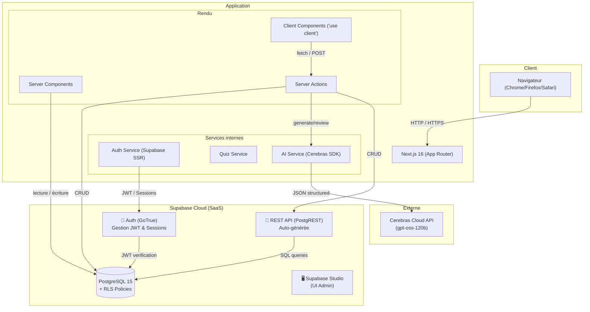
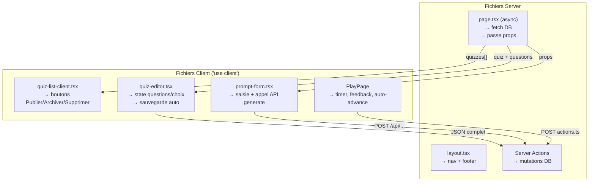
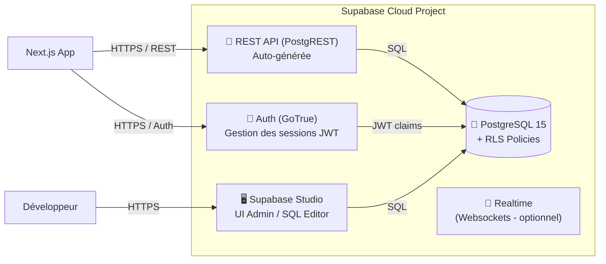
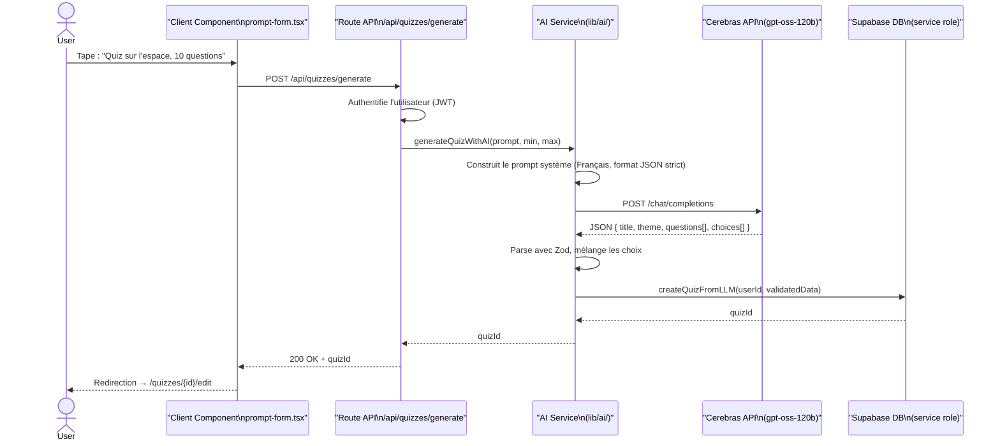
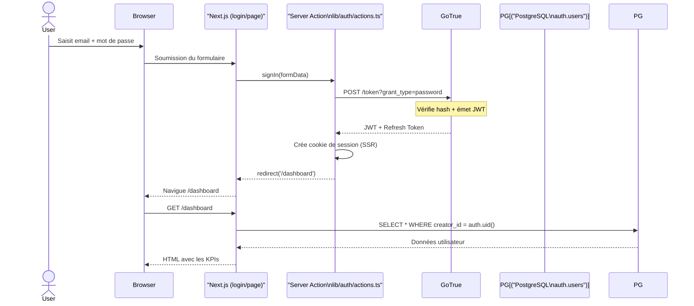
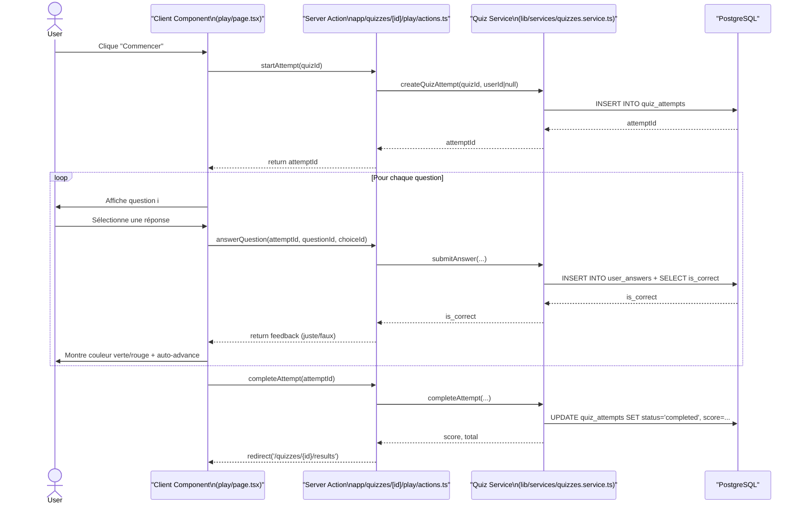

# Rapport d'Infrastructure — Quizia

## Vue d'ensemble de l'architecture

Quizia suit une architecture de type **Jamstack moderne** avec un rendu hybride (Server Components / Server Actions côté serveur, interactivité côté client). L'infrastructure repose principalement sur deux piliers : l'application **Next.js** qui sert de façade et de moteur d'affichage, et **Supabase Cloud** qui gère la persistance, l'authentification et l'API REST sous-jacente. Une troisième source externe, **Cerebras**, sert de générateur de contenu par intelligence artificielle.

---

## Schéma d'architecture haut niveau



---

## 1. Next.js 16 — Application Frontend et Serveur

### Rôle
Next.js constitue à la fois le **serveur web**, le **moteur de rendu** et la **couche applicative**. Contrairement à une architecture classique frontend/backend séparée, Next.js centralise ici le rendu des pages, l'exécution de la logique métier via les Server Actions, et l'interface utilisateur.

### App Router
Introduit dans Next.js 13 et stabilisé en version 16, le **App Router** est basé sur la convention de fichiers du dossier `src/app/`. Il permet :
*   **Server Components par défaut** : les fichiers `page.tsx` sont des fonctions asynchrones exécutées sur le serveur Node.js. Elles peuvent interroger directement la base de données via le `serverClient` Supabase.
*   **Layouts imbriqués** : le fichier `layout.tsx` à la racine définit la structure commune (navigation, pied de page) et les polices.
*   **Streaming progressif** : les données sont envoyées au navigateur au fur et à mesure qu'elles sont disponibles, améliorant le Time To First Byte (TTFB).

### TypeScript
Tout le projet est intégralement typé. Le fichier `tsconfig.json` est configuré avec `strict: true`, ce qui impose la vérification des types nullables, des paramètres implicites, etc. Cela évite les bugs de runtime liés à des propriétés manquantes sur les objets JSON renvoyés par la base de données.

### Pages et routes principales

| Route (fichier) | Type de rendu | Charge de travail |
|-----------------|---------------|-------------------|
| `app/page.tsx` | Server Component | Récupère les quiz publiés pour le "featured" |
| `app/login/page.tsx` | Client Component | Formulaire avec toggle signup/login |
| `app/dashboard/page.tsx` | Server Component | KPIs + historique depuis Supabase |
| `app/my-quizzes/page.tsx` | Server + Client | Server: fetch quiz. Client: actions |
| `app/quizzes/page.tsx` | Server + Client | Server: fetch publiés. Client: filtres |
| `app/quizzes/new/page.tsx` | Server + Client | Authentification requise (AuthGate) |
| `app/quizzes/[id]/edit/page.tsx` | Server + Client | Éditeur avancé (Client) avec données (Server) |
| `app/quizzes/[id]/play/page.tsx` | Client Component | Gestion de l'état du jeu, chronométrage, feedback |
| `app/api/quizzes/generate/route.ts` | Route API | Proxy vers Cerebras + validation |
| `app/api/quizzes/[id]/review/route.ts` | Route API | Proxy vers Cerebras pour correction |

---

## 2. Architecture Client-Side — Interactivité

### Séparation Server vs Client



Les composants marqués `'use client'` sont rendus côté navigateur. Ce sont les seuls à pouvoir utiliser des hooks React (`useState`, `useEffect`, `useRouter`) et à réagir aux événements DOM (clics, saisies). Les composants serveur sont exécutés une seule fois sur le serveur et envoient du HTML pur, optimisant le temps de chargement initial.

---

## 3. Supabase — Backend-as-a-Service (Cloud)

### Vue d'ensemble
Supabase est une alternative open-source à Firebase. Le projet utilise la version **cloud (SaaS)** de Supabase, hébergée sur les serveurs de Supabase. Cela permet de bénéficier de la mise à l'échelle automatique, des sauvegardes gérées et d'une URL d'API toujours disponible sans avoir à maintenir d'infrastructure Docker soi-même. Les données transitent via HTTPS avec authentification par JWT et les tables sont protégées par RLS (Row Level Security).

### Architecture Supabase Cloud



### PostgreSQL — Le cœur de données

La base de données PostgreSQL est le point central de l'architecture. Elle stocke :
*   Les profils et sessions d'utilisateurs (via l'extension `auth` de Supabase).
*   Les quiz, questions, choix et réponses.
*   Les tentatives de quiz et les scores.

Elle est configurée avec des ** contraintes d'intégrité** (clés étrangères avec `ON DELETE CASCADE`, vérifications `CHECK`) qui garantissent que la suppression d'un quiz supprime automatiquement ses questions et ses tentatives, et qu'un score ne peut être négatif.

### Row Level Security (RLS)
PostgreSQL a une fonctionnalité avancée appelée **Row Level Security**. Chaque table a une option `enable row level security`. Des **policies** SQL définissent quelles lignes un utilisateur peut lire ou modifier. Par exemple :
*   Un quiz publié est visible par tout le monde (`SELECT` public).
*   Un quiz en brouillon est seulement visible par son créateur (`SELECT` where `creator_id = auth.uid()`).
*   Seul le créateur d'un quiz peut le modifier (`UPDATE`/`DELETE` where `creator_id = auth.uid()`).

Cela constitue une sécurité en profondeur : même si une requête venait à contourner l'application, la base de données bloquerait l'accès non autorisé.

### GoTrue — Gestion de l'authentification
GoTrue est le service d'authentification de Supabase. Il s'occupe de :
*   L'inscription et la connexion par email/mot de passe.
*   La génération et la vérification des tokens JWT (JSON Web Tokens).
*   La gestion des cookies de session côté navigateur.
*   (Potentiellement) L'authentification OAuth (Google, Apple).

Le token JWT est envoyé avec chaque requête au client Supabase côté Next.js. Ce token contient l'identifiant de l'utilisateur (`sub`), qui est ensuite passé à PostgreSQL via un mécanisme appelé `request.jwt.claims` pour évaluer les politiques RLS.

### PostgREST — API REST automatique
PostgREST lit le schéma PostgreSQL et expose automatiquement des endpoints REST. Par exemple, la table `quizzes` devient automatiquement accessible via `GET /rest/v1/quizzes`. Toutefois, dans ce projet, l'application Next.js utilise principalement le **client JavaScript officiel Supabase** plutôt que des appels HTTP directs à PostgREST. Le client se charge de la gestion des tokens et du formatage des requêtes.

---

## 4. Cerebras — Service d'intelligence artificielle

### Intégration
Cerebras est un fournisseur d'API pour un Large Language Model (LLM). L'application communique avec l'API Cerebras au travers d'un **Route Handler** Next.js (`/api/quizzes/generate` et `/api/quizzes/[id]/review`).

### Flux de génération IA



### Sécurité et validation
La réponse brute de l'IA est **toujours validée** par un schéma Zod avant d'être insérée en base. Cela évite les erreurs de format (clés manquantes, types incorrects) qui pourraient corrompre la base ou provoquer des bugs d'affichage.

### Clé de service (Service Role Key)
Lors de l'insertion du quiz généré par l'IA, l'application utilise une clé d'API spéciale : la **Service Role Key**. Cette clé bypass les politiques RLS. Cela est nécessaire car l'IA n'est pas un "utilisateur authentifié" : on injecte le `creator_id` programmatiquement dans le code serveur. Cette clé est strictement limitée à l'environnement serveur et n'est jamais exposée au navigateur.

---

## 5. Communication réseau et flux de données

### Flux d'authentification



### Flux de jeu (jouer à un quiz)



---

## 6. Gestion des états et données

### Données côté serveur
Dans l'architecture App Router de Next.js, les données principales viennent du serveur. Par exemple, la page catalogue exécute :
```typescript
const supabase = await createClient(); // Server Component
const { data: quizzes } = await supabase.from('quizzes').select('*');
```
Cette requête est exécutée sur le serveur Node.js, côté application. Les données brutes transitent donc du serveur Supabase vers le serveur Next.js, et Next.js génère le HTML final qui est envoyé au navigateur. L'utilisateur voit la page complète sans qu'un seul appel API ne soit visible dans les outils de développement du navigateur.

### Données côté client (interactivité)
Lorsqu'un utilisateur interagit (clic sur "Publier", édition d'une question), l'information doit remonter au serveur. Deux mécanismes sont utilisés :
1.  **Server Actions** : Fonctions asynchrones JavaScript marquées `'use server'` qui s'exécutent sur le serveur Next.js mais sont appelées directement depuis le code client. Elles remplacent les traditionnelles routes API pour les mutations simples.
2.  **Route Handlers API** : Pour les cas complexes (appel à l'IA avec streaming potentiel), l'application expose des routes API conventionnelles (`/api/...`) appelées avec `fetch()` depuis le client.

### Cache et rafraîchissement
L'application n'utilise pas de cache globalisé type Redis. La fraîcheur des données est assurée par :
*   Le **rafraîchissement automatique** de React Server Components lorsqu'une Server Action est invoquée (`router.refresh()`).
*   La **suppression manuelle du cache** (`revalidatePath`) après une mutation majeure.

---

## 7. Sécurité et bonnes pratiques

| Aspect | Implémentation |
|--------|---------------|
| **Authentification** | JWT via Supabase GoTrue, cookies httpOnly |
| **Autorisation** | RLS PostgreSQL + vérification `creator_id` dans le code serveur |
| **Validation** | Zod pour tous les inputs utilisateurs et outputs IA |
| **Injection SQL** | Prévention par l'ORM Supabase (requêtes paramétrées) |
| **XSS** | Échappement automatique par React (pas de `dangerouslySetInnerHTML`) |
| **CSRF** | Protection automatique des Server Actions par Next.js |

---

## 8. Évolutivité (Scalability)

L'architecture actuelle permet plusieurs axes d'évolution :
*   **Horizontal** : Le conteneur Next.js peut être répliqué derrière un load balancer car l'état est stocké dans PostgreSQL, pas en mémoire.
*   **AI Asynchrone** : La génération IA, actuellement synchrone, pourrait être déportée dans une file de tâches (Redis + Bull/Queue) pour supporter des demandes massives sans bloquer les requêtes HTTP.
*   **CDN** : Les assets statiques (images, JS compilé) sont servis par le serveur Next.js, mais pourraient être externalisés sur un CDN pour une distribution globale.
*   **Realtime** : Supabase inclut un service de WebSockets (`Realtime`) qui pourrait être activé pour des fonctionnalités de classement en direct ou de quiz multi-joueurs.

---

## 9. Résumé de l'infrastructure

| Composant | Rôle | Hébergement |
|-----------|------|-------------|
| **Next.js 16** | Rendu, logique métier, API proxy | Local / Vercel / Serveur dédié |
| **Supabase Cloud** | BaaS complet (PostgreSQL, Auth, API, Studio) | SaaS géré par Supabase |
| **Cerebras API** | Génération de contenu IA | Externe (Internet) |
