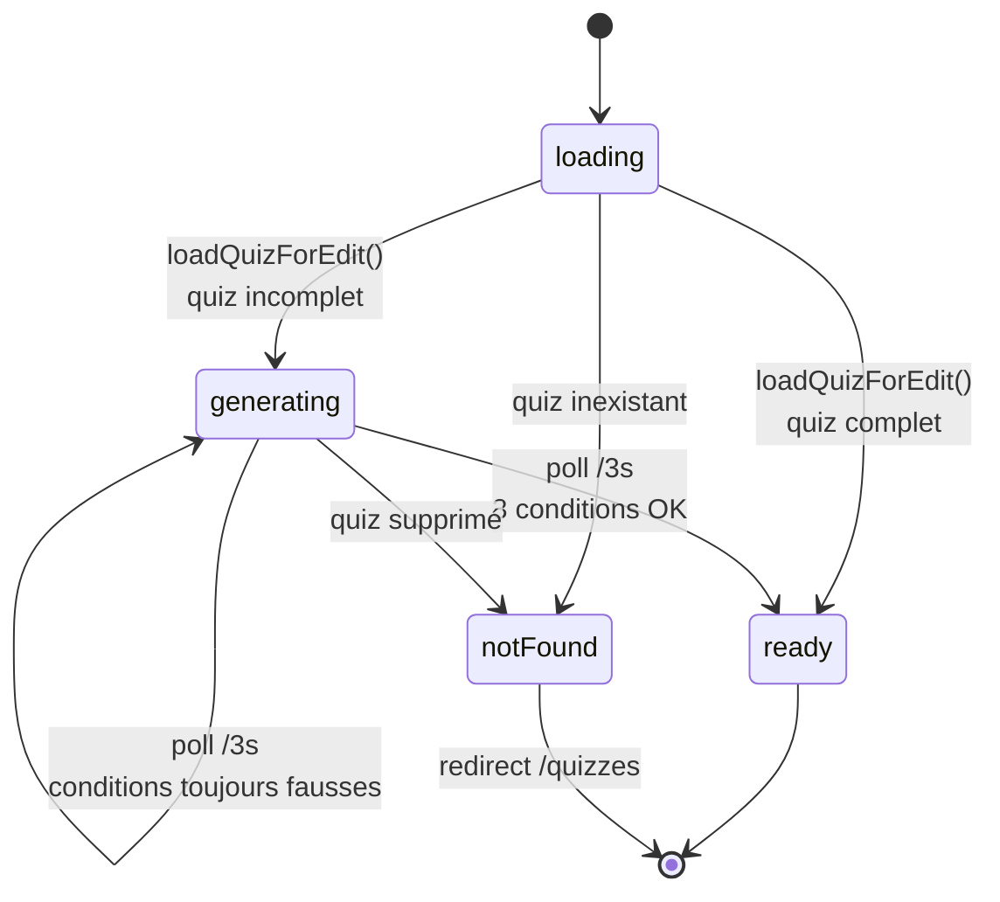
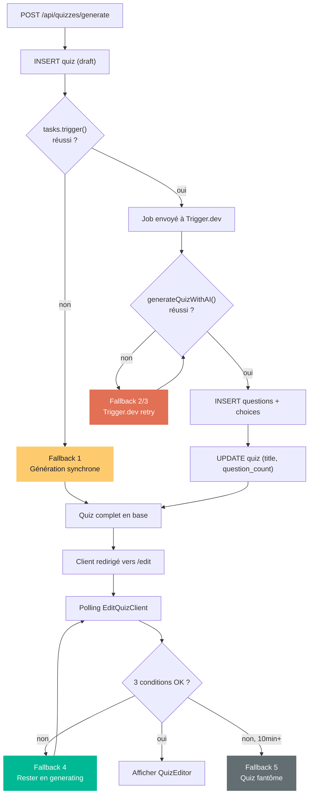

# Mécanismes de fallback — Génération de quiz par IA

Le système de génération de quiz est conçu pour résister à plusieurs types de défaillances. Chaque point de rupture potentiel dispose d'un mécanisme de repli.

```mermaid
flowchart TD
    subgraph Happy["✅ Chemin nominal"]
        A1["API route"] --> A2["Trigger.dev queue"]
        A2 --> A3["Cerebras LLM"]
        A3 --> A4["INSERT DB"]
        A4 --> A5["Polling → ready"]
    end

    subgraph F1["🔁 Fallback 1 : Trigger.dev indisponible"]
        B1["API route"] --> B2["tasks.trigger() lève une exception"]
        B2 --> B3["catch → fallback synchrone"]
        B3 --> B4["generateQuizWithAI() + createQuizFromLLM()"]
        B4 --> B5["Route répond après génération<br/>(bloquant mais garanti)"]
    end

    subgraph F2["🔁 Fallback 2 : LLM répond mais format invalide"]
        C1["LLM répond"] --> C2["JSON.parse() échoue<br/>OU Zod schema invalide"]
        C2 --> C3["throw Error avec détails"]
        C3 --> C4["Trigger.dev retry<br/>(maxDuration: 600s)"]
    end

    subgraph F3["🔁 Fallback 3 : LLM timeout / pas de réponse"]
        D1["LLM call"] --> D2["Pas de response.choices[0]"]
        D2 --> D3["throw 'L\\'IA n\\'a pas généré de réponse'"]
        D3 --> D4["Trigger.dev retry / expire après 10min"]
    end

    subgraph F4["🔁 Fallback 4 : Données incomplètes en base"]
        E1["Polling EditQuizClient"] --> E2{"3 conditions OK ?"}
        E2 -->|non| E3["Reste en 'generating'<br/>continue le polling"]
        E2 -->|non| E3
        E3 --> E1
    end

    subgraph F5["🔁 Fallback 5 : Quiz fantôme (jamais généré)"]
        G1["10 min écoulées"] --> G2["Trigger.dev maxDuration atteint"]
        G2 --> G3["Tâche marquée comme échouée"]
        G3 --> G4["Quiz reste en 'draft'<br/>titre='Génération en cours…'"]
        G4 --> G5["Polling continue indéfiniment<br/>→ utilisateur quitte la page"]
    end

    style F1 fill:#1a1a2e,stroke:#fdcb6e,color:#fdcb6e
    style F2 fill:#1a1a2e,stroke:#e17055,color:#e17055
    style F3 fill:#1a1a2e,stroke:#e17055,color:#e17055
    style F4 fill:#1a1a2e,stroke:#00b894,color:#00b894
    style F5 fill:#1a1a2e,stroke:#636e72,color:#636e72
```



## Fallback 1 : Trigger.dev indisponible

**Point de défaillance :** `tasks.trigger("generate-quiz", ...)` lève une exception (service down, réseau, erreur SDK).

**Mécanisme :** La route API `src/app/api/quizzes/generate/route.ts` fait un `try/catch` autour de l'appel Trigger.dev. Si l'appel échoue, elle exécute la génération **en synchrone** dans la même requête HTTP.

```typescript
try {
  await tasks.trigger("generate-quiz", { ... });
} catch (triggerError) {
  console.error('Trigger.dev non disponible, fallback synchrone', triggerError);
  const llmQuiz = await generateQuizWithAI(prompt, minQuestions, maxQuestions);
  await createQuizFromLLM(llmQuiz, user.id, quiz.id);
}
```

**Impact UX :** La réponse HTTP est plus lente (l'utilisateur attend la génération complète avant la redirection), mais le quiz est créé. Le polling côté `EditQuizClient` n'est pas nécessaire dans ce cas puisque les données sont déjà complètes à l'arrivée.

**Fichiers concernés :**
- `src/app/api/quizzes/generate/route.ts` (lignes 58-74)
- `src/lib/ai/generate-quiz.ts` — appelé directement
- `src/lib/ai/create-quiz-from-llm.ts` — insère en base directement

---

## Fallback 2 : LLM répond avec un format invalide

**Point de défaillance :** Cerebras renvoie du JSON mal formé, ou le JSON ne respecte pas le schéma Zod (`llmQuizSchema`).

**Mécanisme :** Deux niveaux de validation dans `generateQuizWithAI()` :

1. `JSON.parse(raw)` — capture les erreurs de parsing avec un message clair
2. `llmQuizSchema.safeParse(parsed)` — valide la structure complète (titres, questions, choix, booléens `is_correct`)

Si l'un échoue, une `Error` est levée avec le détail des champs invalides.

```typescript
try {
  parsed = JSON.parse(raw);
} catch {
  throw new Error("L'IA a retourné un JSON invalide.");
}

const result = llmQuizSchema.safeParse(parsed);
if (!result.success) {
  const errors = result.error.issues
    .map((i) => `${i.path.join(".")}: ${i.message}`)
    .join("; ");
  throw new Error(`Le JSON généré ne respecte pas le format attendu : ${errors}`);
}
```

**Résultat :** L'erreur remonte à Trigger.dev, qui peut retenter la tâche automatiquement (le LLM peut produire un résultat différent à chaque appel grâce à `temperature: 0.8`). La tâche a 10 minutes (`maxDuration: 600`) pour réussir.

**Fichier concerné :** `src/lib/ai/generate-quiz.ts` (lignes 91-103)

---

## Fallback 3 : LLM ne répond pas (timeout / erreur réseau)

**Point de défaillance :** L'appel à `cerebras.chat.completions.create()` ne retourne pas de `choices[0].message.content`.

**Mécanisme :** Le code vérifie explicitement la présence du contenu :

```typescript
const raw = choice?.message?.content;
if (!raw) {
  throw new Error("L'IA n'a pas généré de réponse.");
}
```

**Résultat :** Comme pour le fallback 2, l'erreur remonte à Trigger.dev qui retente. Si après 10 minutes la tâche n'a toujours pas réussi, elle expire (`maxDuration: 600`).

**Fichier concerné :** `src/lib/ai/generate-quiz.ts` (lignes 87-90)

---

## Fallback 4 : Données incomplètes en base (polling)

**Point de défaillance :** Trigger.dev a commencé à insérer les questions/choix mais n'a pas encore tout écrit au moment où le client fait son poll.

**Mécanisme :** Le polling dans `EditQuizClient` ne passe en `ready` que si les 3 conditions sont simultanément vraies :

| Condition | Code |
|-----------|------|
| Titre finalisé | `title !== 'Génération en cours…'` |
| Toutes les questions présentes | `questions.length >= quiz.question_count` |
| Tous les choix présents | `questions.every(q => q.choices.length >= 2)` |



**Impact :** Tant que Trigger.dev n'a pas fini d'écrire, l'utilisateur voit le spinner. Dès que tout est prêt, l'éditeur s'affiche d'un coup. Aucun état intermédiaire (quiz à moitié chargé) n'est jamais montré.

**Fichier concerné :** `src/app/quizzes/[id]/edit/edit-quiz-client.tsx` (lignes 25-33)

---

## Fallback 5 : Quiz fantôme (Trigger.dev expire sans succès)

**Point de défaillance :** La tâche Trigger.dev a échoué définitivement (10 minutes écoulées, tous les retries épuisés). Le quiz en base a toujours le titre `"Génération en cours…"` et zéro question.

**Mécanisme actuel :** Le polling continue indéfiniment car le titre ne change jamais et `questions.length` reste à 0. L'utilisateur voit le spinner en boucle.

**Limitation connue :** Il n'y a pas de timeout côté client ni de statut `"failed"` sur le quiz en base. L'utilisateur doit quitter manuellement la page. Une amélioration future serait d'ajouter un statut `"error"` dans la table `quizzes` et un timeout client (ex: 2 minutes) qui affiche un message d'erreur avec un bouton "Réessayer".

---

## Résumé des fallbacks

| # | Défaillance | Déclencheur | Mécanisme | Résultat pour l'utilisateur |
|---|-------------|-------------|-----------|-----------------------------|
| 1 | Trigger.dev down | Exception dans `tasks.trigger()` | Fallback synchrone dans la route API | Attente plus longue, mais quiz créé |
| 2 | LLM JSON invalide | `JSON.parse` ou Zod échoue | Error → Trigger.dev retry | Polling continue jusqu'à succès |
| 3 | LLM timeout/réseau | `!choice?.message?.content` | Error → Trigger.dev retry | Polling continue jusqu'à succès |
| 4 | DB partiellement écrite | Polling voit données incomplètes | Le polling refuse de passer en `ready` | Spinner, puis éditeur complet d'un coup |
| 5 | Tâche expire (10min) | Trigger.dev maxDuration | Aucun (limitation connue) | Spinner infini, l'utilisateur quitte la page |

## Diagramme de décision global


