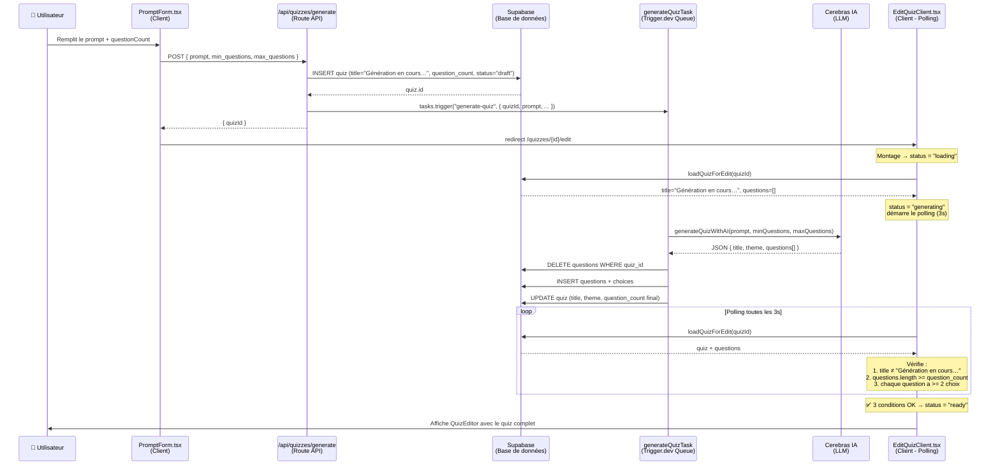
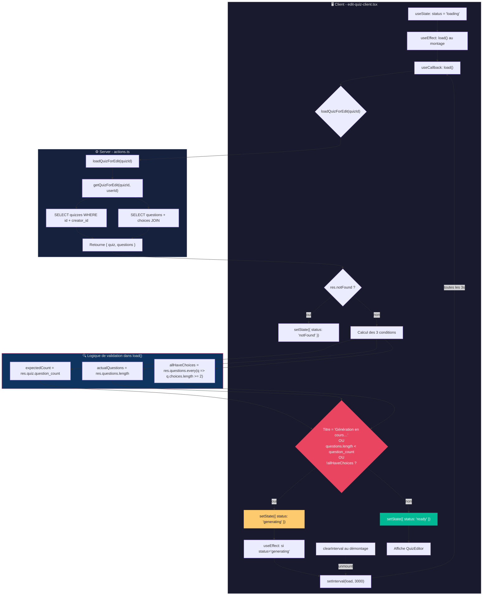

# Système de polling pour la génération de quiz par IA

## Architecture globale

Le système de génération de quiz par IA suit un pattern **création → queue → polling** pour offrir une UX non-bloquante malgré la latence de l'IA.



## 1. Déclenchement : la route API

**Fichier :** `src/app/api/quizzes/generate/route.ts`

1. **Validation** du prompt et des bornes de questions (`minQuestions`/`maxQuestions`) via Zod
2. **Création immédiate** d'un quiz en base avec le statut `draft`, le titre `"Génération en cours…"` et le `question_count` = `minQuestions`
3. **Dispatche le job** à la queue Trigger.dev (`tasks.trigger("generate-quiz", ...)`)
4. **Fallback synchrone** : si Trigger.dev est indisponible, la génération se fait en direct dans la route (bloquant, mais garanti)
5. **Retourne immédiatement** `{ quizId }` au client → redirection vers `/quizzes/{id}/edit`

Le client n'attend jamais la fin de la génération. Il est redirigé vers la page d'édition qui va **observer** l'avancement.

## 2. Queue asynchrone : Trigger.dev

**Fichier :** `src/trigger/generate-quiz.ts`

La tâche `generate-quiz` s'exécute en arrière-plan :

1. Appelle `generateQuizWithAI()` → envoie le prompt à Cerebras (LLM), parse la réponse JSON
2. Supprime les questions existantes du quiz (`DELETE questions WHERE quiz_id = ...`)
3. Insère chaque question et ses choix en base
4. Met à jour le quiz avec le vrai titre, le vrai thème, et le `question_count` final

**Propriétés :**
- `maxDuration: 600` → max 10 minutes d'exécution
- En cas d'échec, Trigger.dev peut retry automatiquement
- Le client n'a aucune dépendance directe à Trigger.dev

## 3. Génération IA : Cerebras

**Fichier :** `src/lib/ai/generate-quiz.ts`

- Utilise le modèle Cerebras (`gpt-oss-120b` par défaut) avec `response_format: "json_object"`
- Le prompt système définit le format JSON attendu et les règles strictes (1 réponse correcte, 2-6 choix, français)
- Après parsing, la sortie est validée avec le schéma Zod `llmQuizSchema`
- Si le LLM génère plus de questions que `maxQuestions`, les questions excédentaires sont tronquées
- Si moins de `minQuestions`, un warning est loggé mais le résultat est accepté
- Un minimum de `minQuestions` était exigé côté route API mais pas forcément respecté par le LLM → c'est là qu'intervient le polling

## 4. Polling client : EditQuizClient

**Fichier :** `src/app/quizzes/[id]/edit/edit-quiz-client.tsx`

### Machine à états

```
loading ──> generating ──> ready
  │            │  ▲
  │            └──┘ (poll /3s)
  v
notFound
```

### Règles de validation (modifiées)

Avant d'accepter les données et de passer en `ready`, le polling vérifie **trois conditions** :

| Condition | Règle |
|-----------|-------|
| Titre | `title !== 'Génération en cours…'` |
| Nombre de questions | `questions.length >= quiz.question_count` |
| Choix complets | Chaque question a `choices.length >= 2` |

Tant que l'une de ces conditions n'est pas remplie, le statut reste `generating` et le polling continue toutes les 3 secondes.

### Ancien comportement (problème)

Le polling vérifiait uniquement `title === 'Génération en cours…' && questions.length === 0`. Dès qu'une seule question apparaissait en base, l'éditeur s'ouvrait — même si 2 questions sur 10 étaient prêtes, ou si des questions n'avaient pas encore leurs choix.

### Nouveau comportement

Le polling attend que **toutes les données soient complètes et cohérentes** avant d'afficher l'éditeur. L'utilisateur voit l'écran de chargement avec le spinner tant que la génération n'est pas terminée, puis l'éditeur s'affiche d'un coup avec toutes les questions et choix.

### Détail technique du load

```typescript
const expectedCount = res.quiz.question_count;  // promis à l'utilisateur
const actualQuestions = res.questions.length;    // réellement en base
const allHaveChoices = res.questions.every((q) => q.choices.length >= 2);

if (title === 'Génération en cours…' || actualQuestions < expectedCount || !allHaveChoices) {
  // reste en generating → continue le polling
} else {
  // passe en ready → affiche l'éditeur
}
```

### Traçage du polling dans le code



## Flux complet

1. **Utilisateur** remplit le formulaire → `questionCount = 10`
2. **Route API** crée le quiz → `question_count = 10`, titre = `"Génération en cours…"`
3. **Route API** envoie le job à Trigger.dev → répond `quizId`
4. **Client** est redirigé vers `/quizzes/xxx/edit`
5. **EditQuizClient** monte → statut `loading` → `loadQuizForEdit()` → titre = `"Génération en cours…"`, questions = [] → statut `generating`
6. **Polling** appelle `loadQuizForEdit()` toutes les 3 secondes
7. **Trigger.dev** appelle Cerebras → le LLM génère 12 questions → tronqué à 10 → insérées en base
8. **Trigger.dev** met à jour le titre et appelle `supabase.update({ title: "...", question_count: 10 })`
9. **Prochain poll** → titre ≠ `"Génération en cours…"`, `actualQuestions (10) >= expectedCount (10)`, `allHaveChoices = true` → statut `ready`
10. **QuizEditor** s'affiche avec le quiz complet

## Points de résilience

- **Trigger.dev down** → fallback synchrone dans la route API (l'utilisateur attend un peu plus mais ça marche)
- **LLM génère moins de questions** → le polling ne passe jamais en `ready` (protection contre les quiz incomplets). Le maxDuration de Trigger.dev (10min) agit comme timeout.
- **LLM génère une question sans choix** → `allHaveChoices` reste faux, polling continue
- **Le `question_count` en base est mis à jour à la fin** par Trigger.dev → reflète le nombre réel de questions générées (peut différer légèrement du `minQuestions` demandé si le LLM a moins produit)
